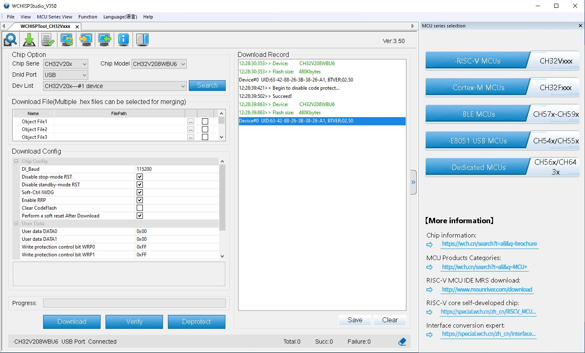
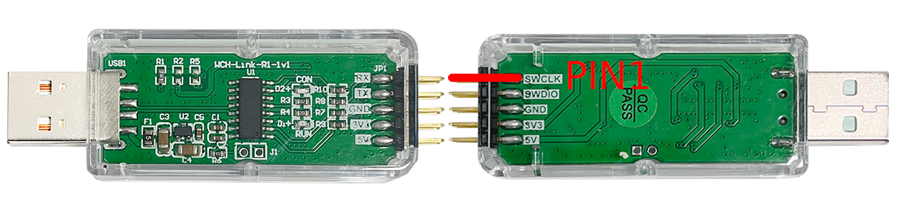

# Bringup
 1. Populate J2 and close it, this will force the board to go into bootloader first
    Do not connect the battery to J5 yet

 2. Start [WCHISP Tool](http://www.wch-ic.com/downloads/WCHISPTool_Setup_exe.html) (Windows only)
    * Connect USB
    * If the device enumerates -> Deprotect the chip
       
       
    * This confirms that the USB layout is working

 3. Now you can use the WCH-Link to program the device. Note the land pattern for the 
    [Tag-Connect TC2050](https://www.tag-connect.com/product/tc2050-idc-tag-connect-2050-idc) follows the pinout for 
    [WCH-Link-R1-1v1](http://www.wch-ic.com/products/WCH-Link.html), connect the ribbon-adapter such that the red
    ribbon (PIN1) aligns with ```SWCLK```.

      

See the [Firmware Repository](https://github.com/treideme/reaction-trainer) for next steps
to set up the device. 

----
Back to [Home](README.md)
