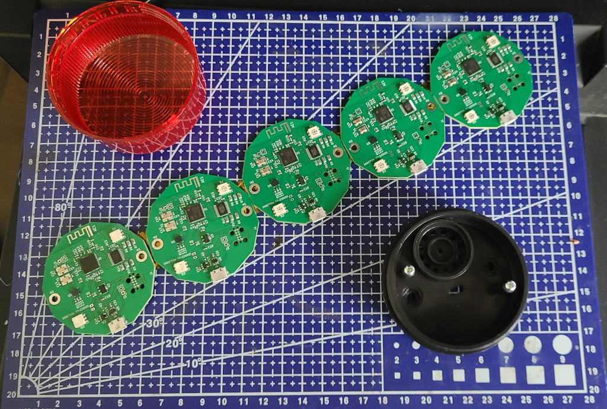
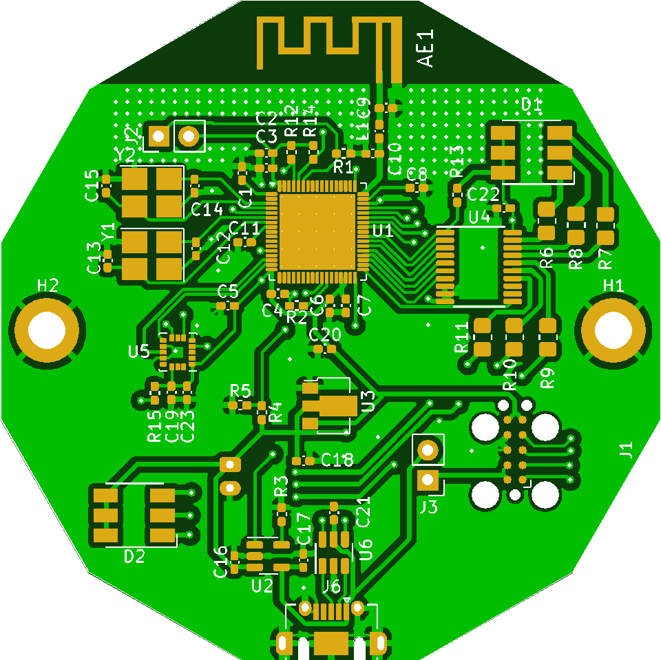
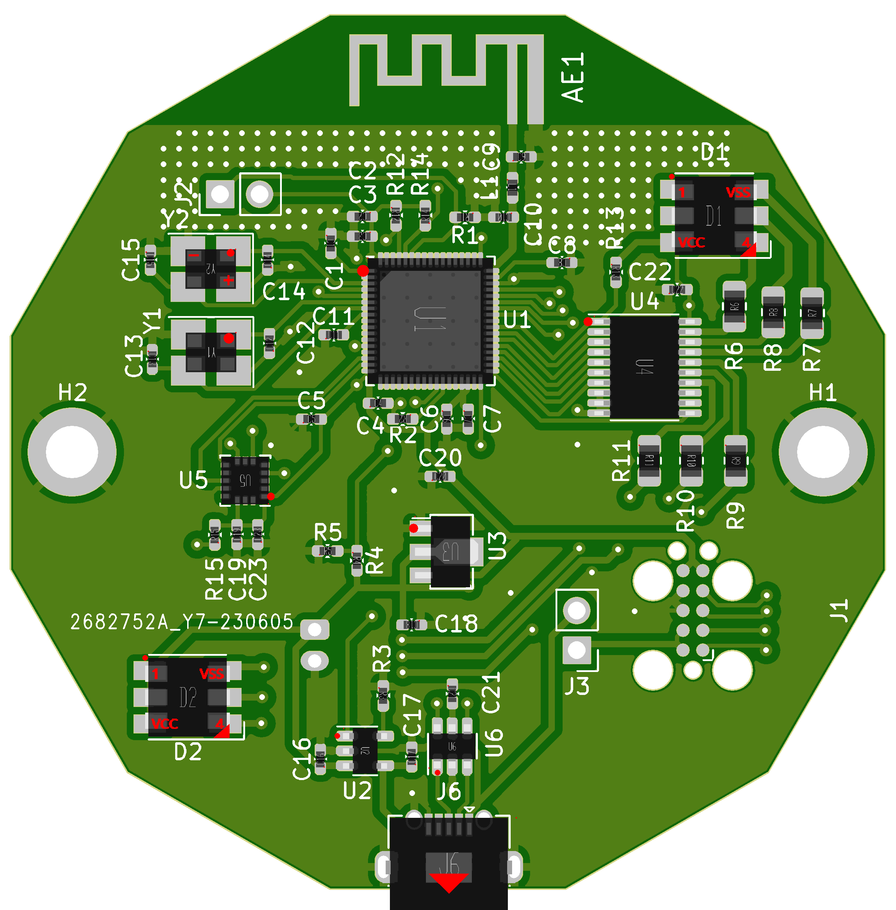

# Next-Generation Reaction Trainer

This repository contains the hardware design, such as PCB files and
mechanical CAD files for the IoT contest. 

Please see my [blog post](https://reidemeister.com/blog/2023.06.06)
for a detailed run-down of the design.

## Requirements 
 * Kicad 6+
 * my fork of [WCH Kicad LBR](https://github.com/treideme/wch-kicad-lbr) to get CH32V208W library parts
   * Big shout out to [sad-electronics](https://github.com/sad-electronics) for laying the ground work

See [my blog post](https://www.reidemeister.com/?p=624) for more information and build updates.

 * [Firmware Sources and Overview](https://github.com/treideme/reaction-trainer)
 * [Android Application Sources](https://github.com/treideme/reaction-trainer-app)

## [Bringup](BRINGUP.md)

----
(C) 2023 Thomas Reidemeister, released under [CERN-OHL-P](LICENSE).

